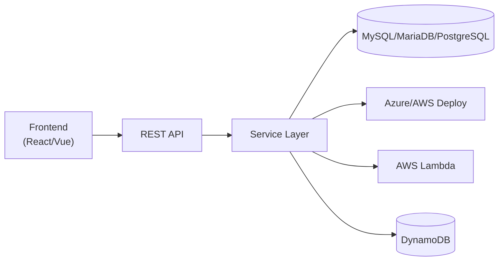

# 👋 Hi, I'm 이상원 (Sangwon Lee)

### 🚀 Full-Stack Developer
Java · Node.js · React · Vue · Spring Boot · TypeScript · PostgreSQL · AWS

### 🎨 재미난 걸 중심으로 개발하는 아티스트
Fun-driven developer artist building with curiosity.

---

## 🧠 About Me

- 🔥 Java & Spring 기반 백엔드 설계
- ⚡ Node.js + React/Vue 프론트엔드 개발
- 🧩 REST API 설계 및 아키텍처 구조 설계
- ☁️ Azure / AWS 기반 배포 경험 (Lambda, EKS)
- 🎯 "기능 구현"보다 "구조 설계"를 중요하게 생각합니다
- 🎨 재미난 아이디어를 중심으로 실험하고 구현하는 개발 아티스트입니다

---

## 🛠 Tech Stack

### Backend

  

### Frontend

  

### DevOps & DB

  

> Also used: **PostgreSQL, AWS Lambda, EKS, DynamoDB**

---

## 📊 GitHub Stats

  
  

---

## 🧩 Architecture Mindset

